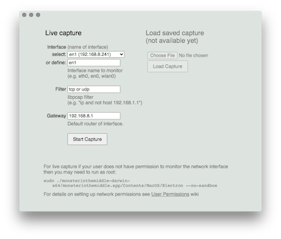
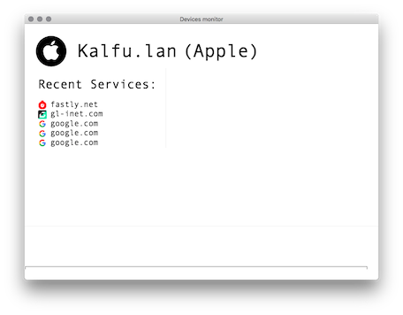
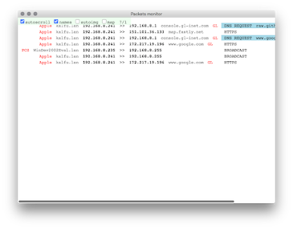
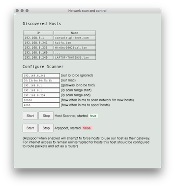

# Monster In The Middle

Monster In The Middle (MiTM) is a network analyzer in the early stages of development. Development is supported by [ISC Project](https://www.iscproject.org/). The current version is not intended for public use. Application is intended for educational purposes only.

**TABLE OF CONTENTS**
- [Monster In The Middle](#monster-in-the-middle)
  - [Linux](#linux)
  - [OSX](#osx)
  - [Windows (NOT READY YET)](#windows-not-ready-yet)
  - [Network Setup](#network-setup)
  - [Use](#use)
  - [Development and Testing](#development-and-testing)
    - [Using Repository](#using-repository)
    - [Build Installation Packages](#build-installation-packages)
  - [Current Status](#current-status)

## Linux

**Prerequisites**

Requires `arp` command. Some systems have this already. Ubuntu does not, install the `net-tools` package.

**Download**

Download from the [releases page](https://github.com/nocompanyco/monsterinthemiddle/releases) the appropriate binary for your system. Extract/unzip the package.

**Permissions**

On Linux configuring the system to allow non-root users to access the network interface requires several steps as described in the [User Permissions](https://github.com/nocompanyco/monsterinthemiddle/wiki/User-Permissions) wiki page. For users that are less familiar with Linux internals we recommend using a Ubuntu Live USB drive (see [docs/Ubuntu_Live.md](./docs/Ubuntu_Live.md) instructions) or running the application with root permissions on a system without sensitive data.

**Start**

To start the application with normal user permissions run the following command from the Terminal: 

    ./monsterinthemiddle-0.1.1-linux-x64/monsterinthemiddle

To start the application as the root permissions: 

    sudo ./monsterinthemiddle-0.1.1-linux-x64/monsterinthemiddle \
      --no-sandbox

## OSX 

**Prerequisites**

Install [Wireshark](https://www.wireshark.org/#download). This will confirm that libpcap is installed and can be used later for troubleshooting purposes.

**Download**

Download from the [releases page](https://github.com/nocompanyco/monsterinthemiddle/releases) the appropriate binary for your system. Extract/unzip the package.

**Permissions**

On OSX configuring the system to allow non-root users to access the network interface is rather simple. Please follow the instructions on the [User Permissions](https://github.com/nocompanyco/monsterinthemiddle/wiki/User-Permissions) wiki page.

**Start**

To start the application with normal user permissions run the following command from the Terminal: 

    ./monsterinthemiddle-0.1.1-linux-x64/monsterinthemiddle
    
Note that currently application only works when started from Terminal. (double-click currently not working)

## Windows (NOT READY YET)

**Prerequisites** 

Install [Wireshark](https://www.wireshark.org/#download). The installer will also install NPcap and ask if you want to restrict network monitoring to administrators only. Choose "no" to allow all users to monitor network without Administrator privileges.

**Download**

Download from the [releases page](https://github.com/nocompanyco/monsterinthemiddle/releases) the appropriate binary for your system. Extract/unzip the package.

**Permissions**

On Windows if when installing Wireshark/NPCap the option to allow all users to access network monitoring was chosen then no changes to permissions are required and application can be started as a normal user. For additional troubleshooting information see [User Permissions](https://github.com/nocompanyco/monsterinthemiddle/wiki/User-Permissions) wiki page.

**Start**

TODO

## Network Setup

Running MiTM without any network modification will only show the network traffic of the MiTM host itself. To see the traffic of other network devices the MiTM host must be made the default router. The MiTM application includes a "Scan and configure network" window which can be used to run an Arpspoof attack to take control of the network default router. This is the quickest and recommended method to get started. For details and additional network configuration options see [docs/Network_Setup.md](./docs/Network_Setup.md).

## Use

1. Settings (first image above): The application will start and show the configuration dialog where user selects the network interface. The interface name and default gateway IP address should be defined by user. These values can be determined by selecting a network interface from the drop down menu or entering the network interface name found from the operating system settings.

2. Devices Monitor (second image above): routinely shows a list of devices found on the network and recent websites and images accessed. This view is shown after the settings dialog. It can also be accessed through the MiTM menu.

3. Packets Monitor (first image below): shows detailed information on individual packets found on network. Currently only known protocols of HTTP, HTTPS, IMAP, POP, SMTP and DNS are shown.

4. Network scan and control (second image below): can be used to scan the network for hosts and forcefully reroute their traffic through the MiTM host using arpspoofing. Click the "**Start**" Host Scanner button to begin collecting network IP addresses. This will scan is limited to scanning for only the 254 IP's within the same class C of the MiTM hosts IP address (e.g. 192.168.1.1 to 192.168.1.254). Once some hosts are list they can be forcefully routed through the monitoring MiTM host by click the "**Start**" Arpspoofing. Aprspoofing has been tested and confirmed to work on OSX and Linux but has not been thoroughly tested on winodws. Also aprspoof is not a full-proof capture method and may not capture all traffic. An alternative to capturing traffic through Arpspoofing is to run MiTM on a host that is acting as the default router for all network clients. 

## Development and Testing

### Using Repository

Install electron UI version:

    npm install
    npm run rebuild_electron
    npm run start_electron

Install console only version, for debugging:

    npm install
    npm rebuild
    npm run start_node

On console each ui element can be executed and tested without electron, using a chrome browser instead:

    node packet.js <network_interface> "tcp or udp" <default_gateway_ip>
    http://localhost:8080

    node devices.js
    http://localhost:8081

    node arpspoof.js --eth <network_interface> --gateway <default_gateway_ip>
    http://localhost:8083

### Build Installation Packages

    npm install

    ON OSX:
    npm run dist:mac

    ON LINUX:
    npm run dist:linux

    ON WINDOWS:
    npm run dist:windows

Find binary packages created in dist directory

## Current Status

- OSX: 
  - double click not working, have to start from console. 
  - User permission is working.
- Windows: 
  - cross-build from linux-wine builds but then application fails on windows. 
  - windows node/electron Visual Studio environment is horrible. Will need to use VM snapshots to figure this out.
  - need to build package on windows, not cross-build from linux
- Linux: 
  - User permissions works but requires steps most users will not be able to follow.
  - Ubuntu Live tested and works